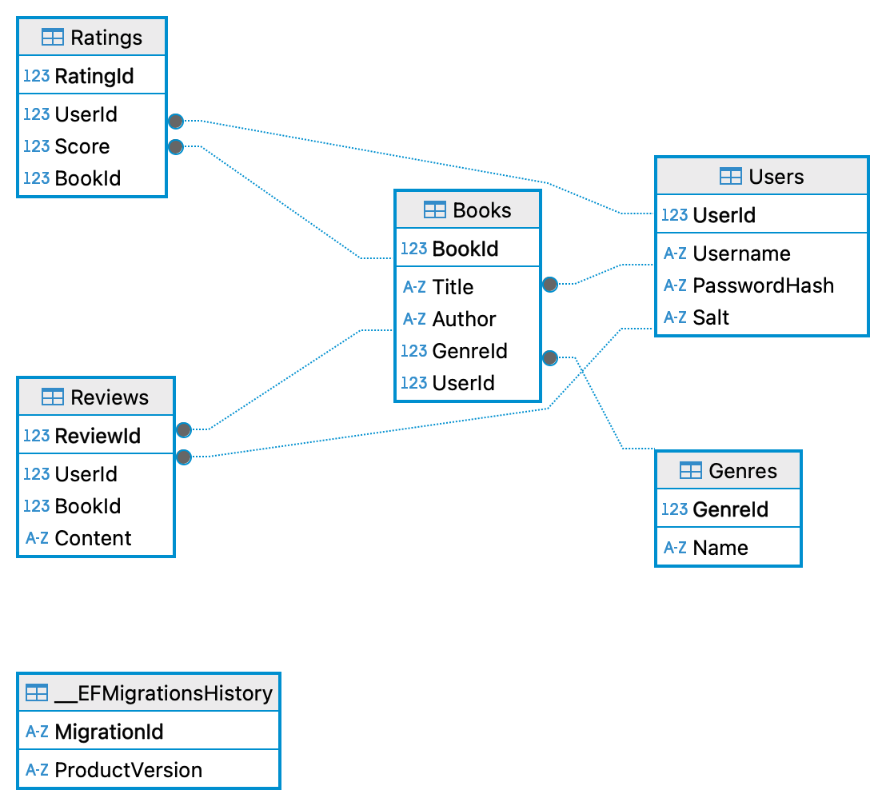

# **Book Track**

## **Description**

BookTrack is a full-stack web application built with **React** (frontend) and **ASP.NET Core** (backend) using **Entity Framework** and **MS SQL Server** for database management. The application follows the **n-tier architecture**, which separates the logic into different layers to enhance scalability, maintainability, and security. 

## **Tech Stack**

- **Frontend**: React, React Router  
- **Backend**: C# ASP.NET Core with Entity Framework  
- **Database**: MS SQL Server  
- **Architecture**: N-Tier Model  

## **Features**

- **User Authentication**: Secure login and registration with JWT-based authentication.
- **CRUD Operations**: Users can read, create, update, and delete books with reviews and ratings.
- **Routing**: React Router is used for client-side navigation between different pages.
- **Database Management**: Utilizes MS SQL Server for data storage and Entity Framework for ORM (Object-Relational Mapping).

## **Folder Structure**

- **/Controllers**: Handles incoming HTTP requests and routes them to appropriate service methods.
- **/Models**: Defines the data structures and represents the database schema.
- **/Services**: Contains business logic and interacts with the data layer.
- **/DataAccess**: Contains the database context class that sets up the connection to MS SQL Server and defines DB sets.
- **/Utilities**: Contains the Hasher logic used to generate JWT tokens.
- **/Program**: Contains all necessary app configurations.

## **Getting Started**

### **Installation**

1. **Clone the repository**

2. **Frontend Setup**

   - Navigate to the frontend directory:

     ```bash
     cd frontend
     ```

   - Install dependencies:

     ```bash
     npm install
     ```

   - Start the frontend development server:

     ```bash
     npm run dev
     ```

3. **Backend Setup**

   - Navigate to the backend directory:

     ```bash
     cd backend
     ```

   - Install dependencies and build the project:

     ```bash
     dotnet restore
     dotnet build
     ```

   - Configure the database connection string in `appsettings.json`, as well as the JWT secret.

   - Run migrations to set up the database:

     ```bash
     dotnet ef database update
     ```

   - Start the backend server:

     ```bash
     dotnet run
     ```

### **Environment Variables**
Create a `.env` file in the frontend directory for storing API URLs.

## **Database Schema and Relationships**

Below is the **Entity Relationship Diagram (ERD)** representing the structure of the database:



### **Relationships Explanation**

- **User - Book (One-to-Many)**: A user can create multiple books, but a book belongs to only one user.
- **Book - Genre (Many-to-One)**: A book belongs to a single genre, but a genre can have multiple books.
- **Book - Review (One-to-Many)**: A book can have multiple reviews, but each review is associated with only one book.
- **User - Review (One-to-Many)**: A user can write multiple reviews, but each review belongs to only one user.
- **Book - Rating (One-to-Many)**: A book can have multiple ratings, but each rating is linked to only one book.
- **User - Rating (One-to-Many)**: A user can rate multiple books, but each rating is linked to only one user.
